# naive-cloud-cover-detection

With `threashold` set to `130`;
```
File: Data/62.png. Cloud Cover: 58%
File: Data/76.png. Cloud Cover: 87%
File: Data/99.png. Cloud Cover: 99%
File: Data/8.png. Cloud Cover: 15%
File: Data/66.png. Cloud Cover: 73%
File: Data/15.png. Cloud Cover: 27%
File: Data/17.png. Cloud Cover: 38%
File: Data/1_but_over_water.png. Cloud Cover: 0%
File: Data/13_planet_but_whispy_I_would_say_80.png. Cloud Cover: 94%
File: Data/19_hazy.png. Cloud Cover: 65%
File: Data/81.png. Cloud Cover: 63%
File: Data/41.png. Cloud Cover: 45%
File: Data/50.png. Cloud Cover: 59%
File: Data/11_but_over_water_again.png. Cloud Cover: 2%
File: Data/72_from_planet_I_would_say_95.png. Cloud Cover: 100%
File: Data/91.png. Cloud Cover: 95%
```

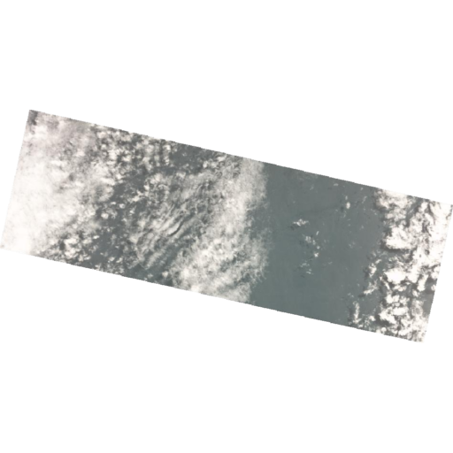 Planet: 62% My code: 58%
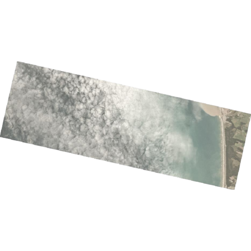 Planet: 76% My code: 87%
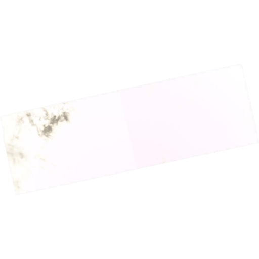 Planet: 99% My code: 99%
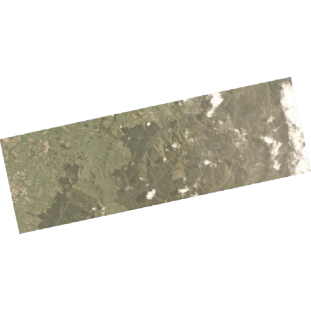 Planet: 8% My code: 15%
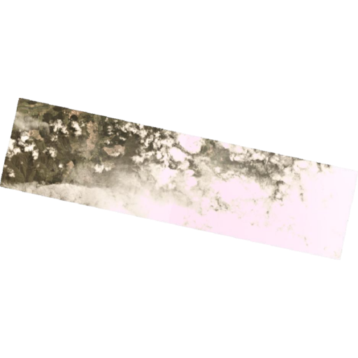 Planet: 66% My code: 73%
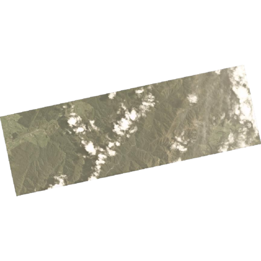 Planet: 15% My code: 27%
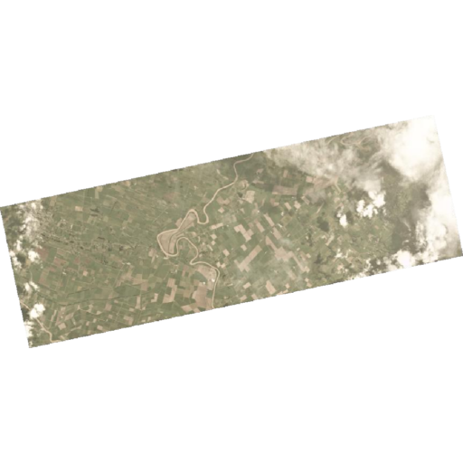 Planet: 17% My code: 38%
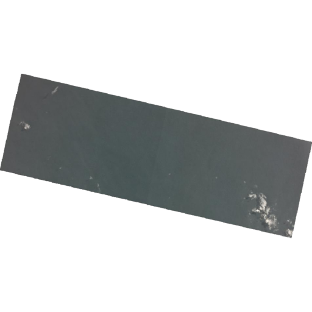 Planet: 1% My code: 0%
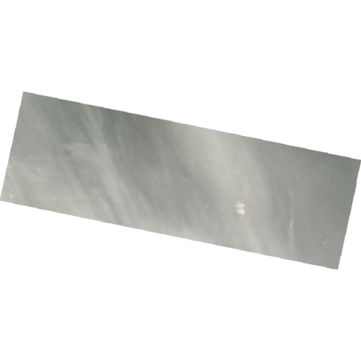 Planet: 13% ( I'd say 80%) My code: 94%
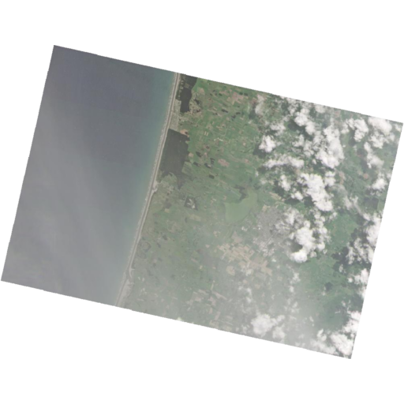 Planet: 19% but hazy My code: 65%
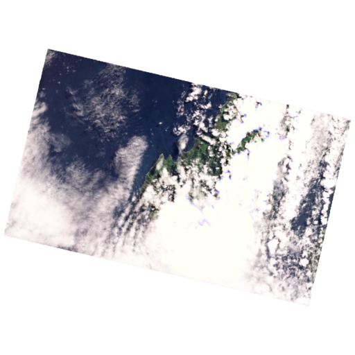 Planet: 81% My code: 63%
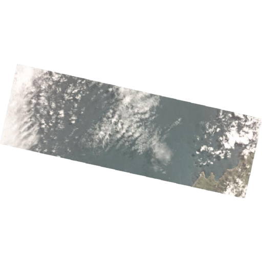 Planet: 41% My code: 45%
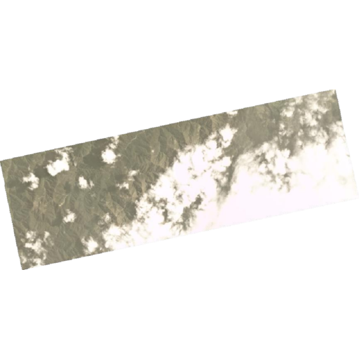 Planet: 50% My code: 59%
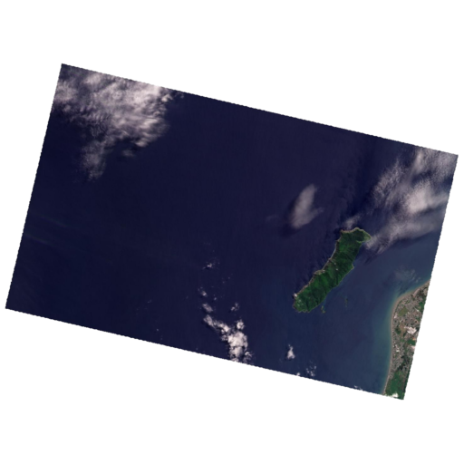 Planet: 11% My coder: 2%
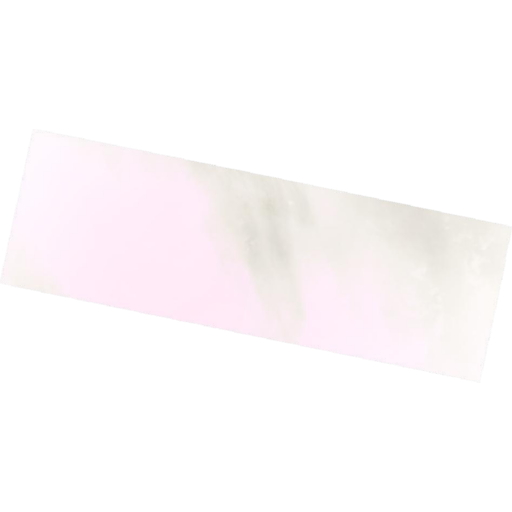 Planet: 72% but I would say 95% My code 100%
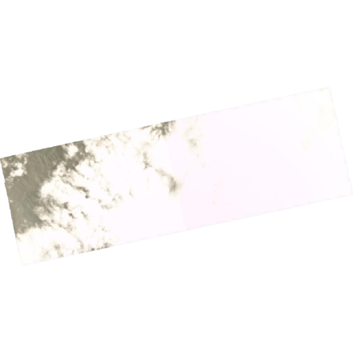 Planet: 91% My code: 95%
